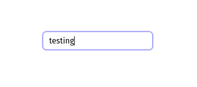
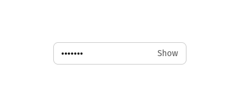
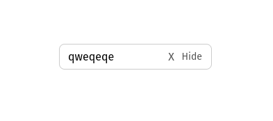
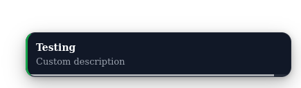
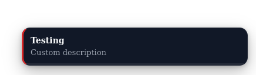
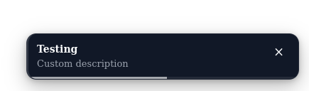
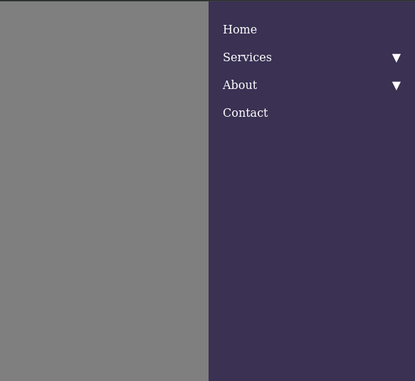

# Interview Storyboard

## Setup the enviroment doing:
```bash
npm install
npm run storybook
```
The storybook should be running in the http://localhost:6060

## This project contains 3 components

### Input




### Toast




### Menu sidebar



